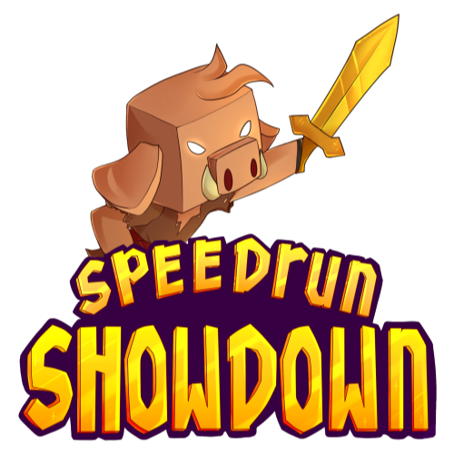

[](https://github.com/KaiNakamura/SpeedrunShowdown/blob/master/LICENSE)
[](https://github.com/KaiNakamura/SpeedrunShowdown/actions)
[](https://github.com/KaiNakamura/SpeedrunShowdown/releases)

<p align="center">
	<a href="https://github.com/KaiNakamura/SpeedrunShowdown">
		
	</a>
	<h2 align="center">
		Minecraft Speedrunning and PvP Plugin
		<br />
		<a href="https://smash.gg/mcss">Tournament</a>
		·
		<a href="https://github.com/KaiNakamura/SpeedrunShowdown/issues">Report Bug</a>
		·
		<a href="#installation"><b>INSTALLATION INSTRUCTIONS</b></a>
	</h2>
</p>

## Table of Contents

* [About](#about)
* [Installation](#installation)
* [Setup](#setup)
	* [Teams](#teams)
	* [Commands](#commands)
* [Config](#config)
* [Issues](#issues)
* [License](#license)

## About

This project is a Minecraft speedrunning and PvP plugin. Teams of players race to be the first to kill the Ender dragon. All players are equipped with a tracking compass that can point to the nearest enemy or teammate.

In 30 minutes sudden death begins, all players will be teleported to the end and players can no longer respawn. The timer will not count down if a player is in the End.

Bed and respawn anchor explosions are disabled, spawners are unbreakable, and portal/spawn trapping is not allowed (see [config](#config) for more details).

The team that deals the final blow to the dragon is the winner, may the best team win!

## Installation

Download the latest version from [releases](https://github.com/KaiNakamura/SpeedrunShowdown/releases) and place the JAR file in the plugins folder of your server.

## Setup

### Teams

Before you begin the game you will want to create teams.

To add players to a team run:
```
/team join <team> [<members>]
```
*For more team commands see the [Minecraft Wiki](https://minecraft.gamepedia.com/Commands/team)*

The default team names are the following, but can be edited in the [config](#config):
* Redstone
* Lapis
* Emerald
* Gold
* Diamond
* Quartz
* Purpur
* Iron
* Crimson
* Ice
* Slime
* Glowstone
* Prismarine
* Netherite
* Chorus
* Obsidian

### Commands

| Command | Description | Notes |
| --- | --- | --- |
| `/start` | Start the game | Sets time to 0 and gives all players a tracking compass, full health, and full hunger |
| `/stop` | Stop the game | |
| `/config` | Open config gui | If more than one player is editing the config, the latest changes take priority, see [config](#config) for more details |
| `/suddendeath [minutes]` | Set time until sudden death | If no time given, starts immediately |
| `/givecompass [player]` | Give a tracking compass | All players are given a compass at the start of the game, this command is to be used if a player doesn't receive a compass |
| `/givearmor [player]` | Give armor | All players are given armor at the start of the game if `give-armor` is set to true in the [config](#config), this command is to be used if a player doesn't receive armor |
| `/win (team\|player)` | Declare the winning team | The winning team automatically declared when dragon is killed, this command is to be used if something goes wrong such as the dragon being killed by an entity other than a player |

*If a command from this plugin conflicts with a command from another plugin use the prefix:*

`/speedrunshowdown:<command>`

## Config

The config file is a list of editable settings to change different aspects of gameplay. The easiest way to change the config is with the `/config` command.

For more control over the config, navigate to the [config.yml](https://github.com/KaiNakamura/SpeedrunShowdown/blob/master/src/main/resources/config.yml) file in the plugins folder of your server under `SpeedrunShowdown\config.yml`

| Attribute | Default | Description | Notes |
| --- | --- | --- | --- |
| `sudden-death-time` | 30 minutes | The time in minutes until sudden death | |
| `countdown-time` | 3 seconds | The time in seconds to count before the game begins | |
| `grace-period` | 30 seconds | The time in seconds until PvP is enabled | |
| `respawn-invincibility` | 15 seconds | The time in seconds until a respawned player can be damaged | |
| `portal-invincibility` | 15 seconds | The time in seconds until a player coming through a portal can be damaged | |
| `warning-times` | [60, 30, 15, 10, 5, 4, 3, 2, 1] seconds | The times in seconds at which a warning will be given before sudden death | |
| `portal-alerts` | true | When a player enters a portal, broadcast the coordinates of the portal | |
| `world-border` | true | Creates a world border that prevents players from going to strongholds beyond the first ring and prevents players from leaving the main island in the End | World border goes from -3000 to 3000 in the Overworld, -375 to 375 in the Nether, and -500 to 500 in the End |
| `prevent-bed-explosions` | true | Prevent players from exploding beds | Beds can still be used in the Overworld |
| `prevent-respawn-anchor-explosions` | true | Prevent players from exploding respawn anchors | Respawn anchors can still be used in the Nether |
| `indestructable-spawners` | true | Make spawners indestructable | |
| `must-kill-dragon-to-win` | true | Players must kill the dragon to win | If set to false, the last remaining team will be declared the winner, otherwise if all teams are dead players will be respawned |
| `hide-spectator-advancements` | true | Hide advancements earned by spectators from being announced in chat | Spectators include anyone in the spectator gamemode |
| `give-compass` | true | Give tracking compass to players at start and on respawn |  |
| `keep-armor` | true | Keep armor on death | Player will only keep armor that they are wearing on death |
| `keep-tools` | true | Keep tools on death | Tools include pickaxes, axes, shovels, hoes, swords, shields, bows, and crossbows |
| `give-armor` | false | Give leather armor to players at start and on respawn | Armor is dyed to the team color and has curse of vanishing |
| `efficient-tools` | false | Tools will be enchanted with Efficiency III and Unbreaking I | Tools are enchanted on use |
| `smelt-ores` | false | Ores will drop as ingots instead of ores |  |
| `cook-food` | false | Animals will dropped cooked food |  |
| `randomize-drops` | false | Item drops will be replaced by another random item |  |
| `permanent-potions` | false | All potion effects will be made permanent | Does not apply to invincibility given by the plugin |
| `teams` | See [teams](#teams) | The team names and colors | A team requires a name and a color, `name: "COLOR"`, the color must be a [Minecraft color code](https://minecraft.gamepedia.com/Formatting_codes#Color_codes): BLACK, DARK_BLUE, DARK_GREEN, DARK_AQUA, DARK_RED, DARK_PURPLE, GOLD, GRAY, DARK_GRAY, BLUE, GREEN, AQUA, RED, LIGHT_PURPLE, YELLOW, WHITE |

## Issues

To report a bug or to request a feature go [here](https://github.com/KaiNakamura/SpeedrunShowdown/issues).

## License

Distributed under the [MIT License](https://github.com/KaiNakamura/SpeedrunShowdown/blob/master/LICENSE).
